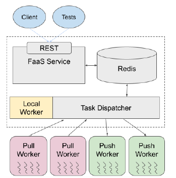

# FaaS Builders - A Distributed Function as a Service Platform 



Function-as-a-Service (FaaS) platform is a medium for developers to deploy their functions in a serverless environment and run them on demand. The platform is designed to be scalable and fault-tolerant. Clients who register their functions can run them concurrently on the platform.

The platform consists of:
- **FaaS REST Service**: Receives HTTP requests, executes functions, and returns task results and statuses.
- **Redis Database**: Stores function payloads, parameters, statuses, and results.
- **Task Dispatcher**: Executes or assigns tasks to workers.
- **Workers**: Execute the function tasks.

## Components

### FaaS REST Service

Implemented using FastAPI, the REST Service provides four main endpoints:
- `/register_function` 
- `/execute_function` 
- `/result/<task_id>`
- `/status/<task_id>`

#### Function Registration

Accepts serialized function bodies. Generates a unique UUID for the function, stores the function name and payload in Redis, and returns the UUID to the client.

#### Task Execution

Accepts function UUID and parameters. Validates the function in Redis, creates a new task UUID, stores function ID, parameters, status, and result in Redis. Publishes task ID to Redis "Tasks" channel and returns task UUID to the client.

#### Status

Accepts task ID and retrieves the current task status from Redis. Task states: QUEUED -> RUNNING -> COMPLETED or FAILED.

#### Result

Accepts task ID and fetches execution result or exception details.

### Redis

Redis serves as a distributed key-value store and message queue system.

#### Key-Value Store

Stores three types of data:
1. **Function Registry Records**:
   - Key: `function:function_UUID`
   - Value: Function name, Function payload
2. **Task Records**:
   - Key: `task:task_UUID`
   - Value: Function UUID, Parameters, Task status, Task result/error message
3. **Task Queue**:
   - Redis Pub/Sub for publishing new tasks to the "Tasks" channel

### Task Dispatcher

#### Local Mode

1. Initializes a pool of worker threads or processes.
2. Fetches tasks from Redis, places them in an internal queue, and distributes them among local workers.
3. Workers execute tasks and update the status and result in Redis.
4. Handles task timeouts and marks failed tasks appropriately.

#### Push Mode

1. Maintains a global queue of tasks and assigns them to workers.
2. Workers register with the dispatcher and send periodic heartbeats.
3. Distributes tasks to the least-loaded workers.
4. Workers acknowledge task receipt, process tasks, and send results back to the dispatcher.
5. Dispatcher updates task state in Redis and handles timeouts and worker failures.

#### Pull Mode

1. Idle workers request tasks from the dispatcher.
2. Dispatcher assigns tasks to workers and updates task state in Redis.
3. Workers execute tasks and report results back to the dispatcher.
4. Dispatcher updates task state in Redis and handles timeouts and worker failures.

### Pull Workers

1. Register with the dispatcher.
2. Initialize a process pool for concurrent task execution.
3. Main loop: Check process pool capacity, request tasks, execute tasks, and report results.

### Push Workers

1. Register with the dispatcher and initialize threads for heartbeats, task receipt, processing, and result sending.
2. Listen for tasks, process them, and send results back to the dispatcher.
3. Send periodic heartbeats to signal availability.

## Choosing between Local, Push, and Pull Mode

- **Local Mode**: Simple implementation, minimal communication overhead, limited to single machine resources.
- **Push Mode**: Specific worker-task assignments, higher communication overhead.
- **Pull Mode**: Dynamic task assignments, reduced need for pre-defined task assignments.

## Instructions

### Install Dependencies
```bash
# In project root directory
pip install -r requirements.txt
```

### Pull the latest version of the Redis image from Docker Hub
```bash
docker pull redis:latest
```

### Run Redis with Docker
```bash 
docker run -d --name faasredis -p 6379:6379 redis:latest
```

### Start REST Service
```bash
# In project root directory
uvicorn rest_service.main:app --reload
```

### Start Task Dispatcher
```bash
# In project root directory 
# Example usage : python task_dispatcher/task_dispatcher.py -m pull -p 8888 -w 1
python task_dispatcher/task_dispatcher.py -m [local/pull/push] -p <port> -w <num_worker_processors>
```

### Start Worker Processor
```bash
# In project root directory
# Example usage: python workers/pull_worker.py 1 tcp://localhost:8888
python workers/pull_worker.py <num_worker_processors> <dispatcher url>
python workers/push_worker.py <num_worker_processors> <dispatcher url>
```

### Run Tests
```bash
# In project root directory (Make sure the REST service and Redis are running)
pytest
```

### Run Performance Measurement
```bash
# In project root directory (Make sure the REST service and Redis are running)
python performance/performance.py
```

### Create Chart Based on Performance Measurement
```bash
# In project root directory
python performance/chart.py
```
