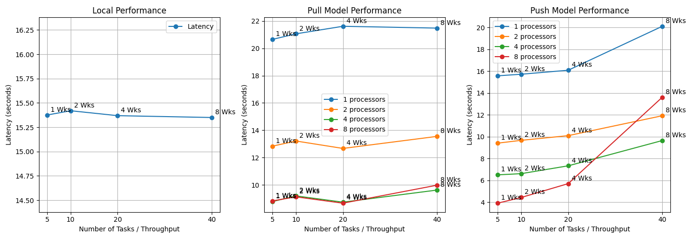

# Performance Report

## Overall Observation

Local mode maintains a flat latency of about 15 seconds as more workers are added, indicating consistent performance and scalability.

Push and pull modes also show flat latency with a worker-to-tasks ratio of 5, suggesting scalability. However, the tail of the lines rises slightly, especially for push mode, indicating minor performance degradation with more workers.

With 1 worker/processor, local mode has the lowest latency due to the absence of communication overhead between the task dispatcher and workers.

## Alignment to Distributed Systems Definition

According to Tanenbaum, a distributed system is "a collection of autonomous computing elements that appears to its users as a single coherent system." Our system aligns with this definition in two ways:

1. It is a collection of services (REST service, task dispatcher, Redis, workers) that work together to provide a coherent system to the user.
2. It largely scales to support more user tasks, maintaining performance with minor degradation due to inevitable communication overhead.

## Scalability 

### Horizontal Scaling Performance (More workers)

Horizontal scaling involves adding more workers to support more tasks, keeping processors unchanged.

- **Local Mode**: Best scalability with the flattest latency line due to minimal communication overhead.
- **Pull Mode**: Second best, with slight latency increase due to socket locking and timer-based failure detection.
- **Push Mode**: Worst scalability with noticeable latency increase due to heartbeat and load balancing overhead.

### Vertical Scaling Performance (More processors)

Vertical scaling involves adding more processors to support more tasks, keeping workers unchanged.

- **Local Mode**: Not applicable as only horizontal scaling is considered.
- **Pull Mode**: Latency decreases with more processors, but scalability diminishes due to socket probing and idle processors.
- **Push Mode**: Better scalability than pull mode, with clearer latency reduction due to continuous task dispatching without locks.

In both modes, scalability is evident but not linear due to communication overhead and unavoidable sequential execution portions.

## Limitations of Distributed System

1. **Network Latency and Communication Overhead**: Significant impact on performance, especially with high intercomponent communication.
2. **Locks**: Limit scalability and performance, causing workers to wait for access to shared resources.
3. **Load Balancing**: Increased complexity and time to distribute tasks as the number of workers grows.
4. **Failure Detection**: Longer detection times with more workers and processors, affecting system reliability and performance.

## Optimization Opportunities

1. **Efficient Load Balancing Algorithms**: Reduce overhead and distribution time, especially in push models.
2. **Optimize Timer and Heartbeat Mechanism**: Dynamically adjust timers and heartbeat intervals based on system load and failure rates.
3. **Efficient Parallelism**: Adjust the number of workers/processors according to workload and consider lock-free data structures.
4. **Caching**: Cache results of frequently called functions to avoid recomputation, using Redis for storage.

